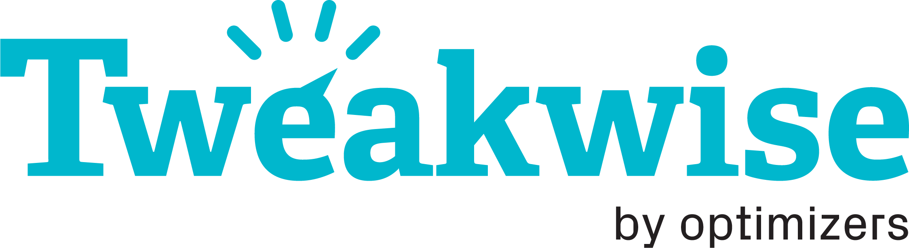

# Tweakwise for Shopware 6
This extension will connect your Shopware 6 installation with Tweakwise.
With the software of Tweakwise, you will boost your conversions. More information
about Tweakwise can be found on their [website](https://www.tweakwise.com).

## About this extension
This extension is still in development. I will add more and more features over time.
At the moment the following features are supported:

- Fully customizable product feed which out-of-the-box gives you a valid feed for Tweakwise

_All features are tested on a default Shopware 6 installation and in a real-life webshop_

## Roadmap
Tweakwise offers a lot of really nice features. Those features don't work out-of-the-box on your site
and therefor those features needs to be integrated into the extension. I don't have an exact roadmap 
at the moment, but things you can expect are:

- **Basic JavaScript implementation** so you can be up-and-running in a matter of minutes
- With the **Standard Site Search based on the API** you will be able to use Tweakwise without the need to include the JavaScript library of Tweakwise. 
- The **Autocomplete** feature will also be included.

## Demo
You can find an implementation of the latest version on https://www.driekleinehaasjes.nl.

## Support
This is an opensource extension and the development of this extension is on a voluntary basis. Therefor I can't provide you
free support. Luckily there are some possibilities to get the most out of the extension.

### Documentation
You can find a small manual at [GitHub](https://github.com/richardhaeser-com/sw-tweakwise/wiki/Documentation). 
This manual will help you to setup the extension. The documentation will be updated on every release so
make sure you keep an eye on it.

### Bugs
As I am just a human, I am sure there are bugs in this extension. If you have found such a bug, please
report them on [GitHub](https://github.com/richardhaeser-com/sw-tweakwise/issues).

### Feature requests
Do you want a feature of Tweakwise that is not yet implemented, please [get in touch](mailto:support@richardhaeser.com) with me. Together we can discuss 
when this feature can be implemented and on what conditions.

### Additional support
If you have a difficult time to get the extension working and the manual is not giving you the information you need,
you are able to get paid support. Please [get in touch](mailto:support@richardhaeser.com) with me so we can discuss the possibilities.

## About me
My name is Richard Haeser. I'm a freelance PHP-developer and specialised in creating value
for your business. Most of my work is based on Symfony, Shopware or TYPO3. Want to know more about me?
Check out my [website](https://www.richardhaeser.com).

